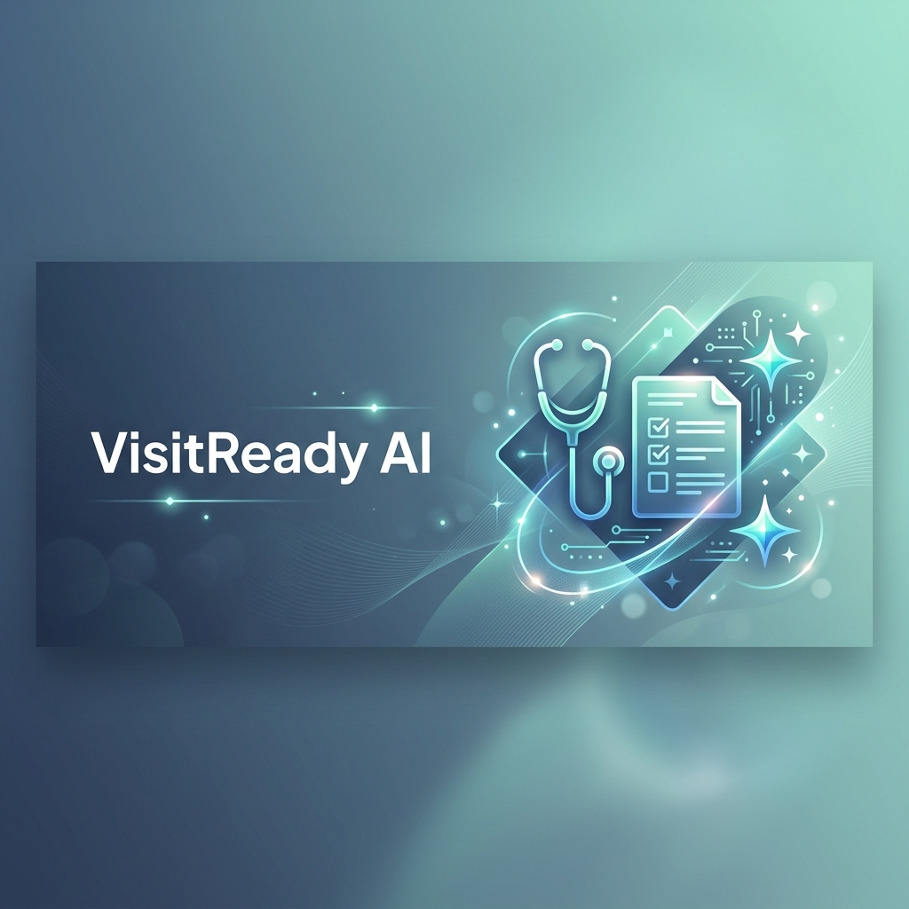
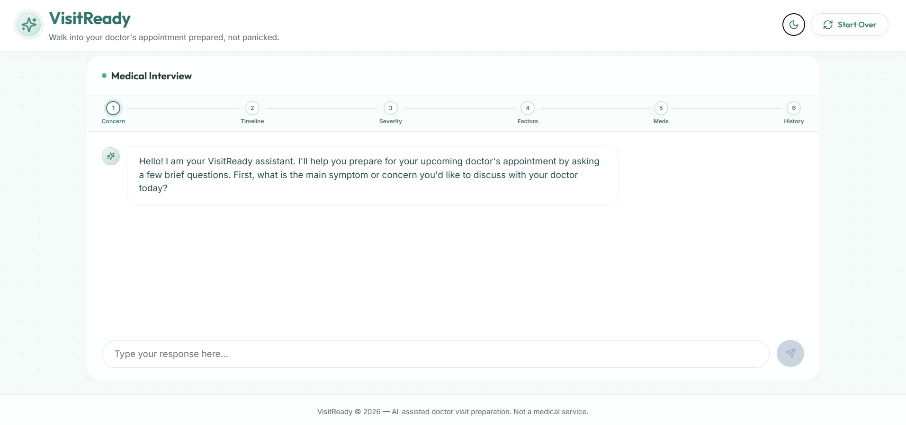
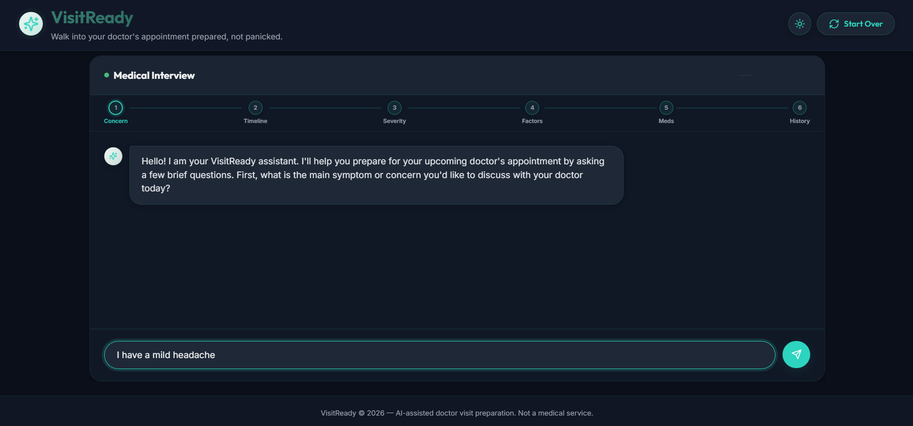
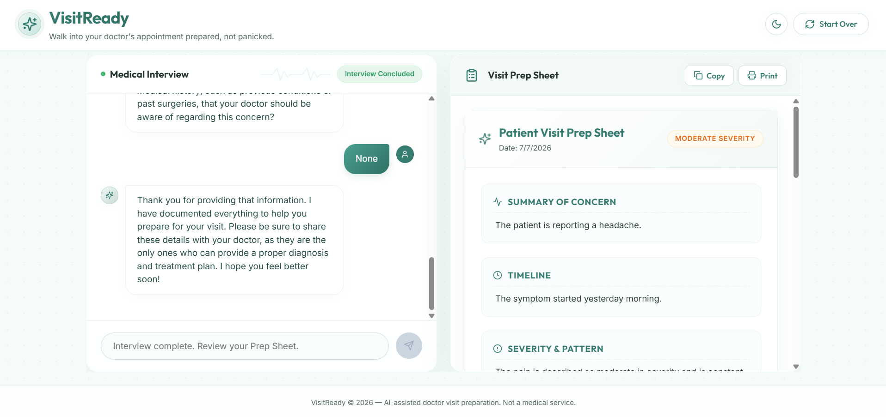
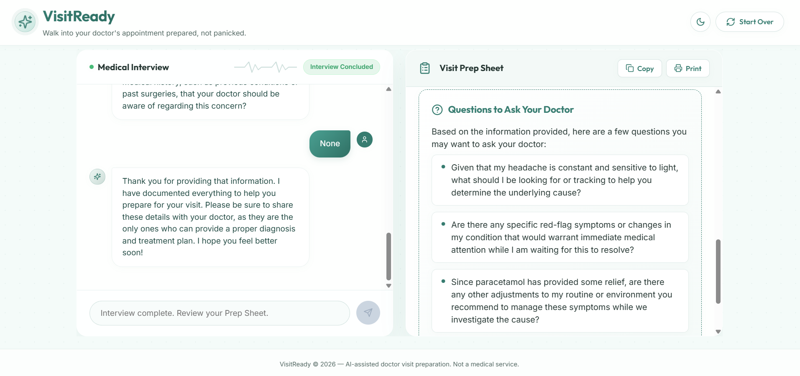
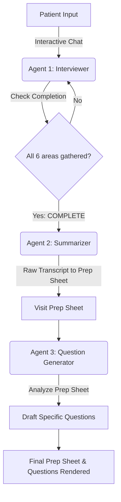

# VisitReady 🩺 - AI-powered prep for your next doctor's visit.



Walk into your doctor's appointment prepared, not panicked. **VisitReady** is a modern, responsive single-page application (SPA) powered by Gemini models that guides patients through an intuitive, empathetic medical intake interview. It summarizes concerns, highlights clinical details, and drafts personalized questions to ask the doctor.

---

## 🚀 Key Features

- **Empathetic AI Interview**: Guides patients one question at a time to gather clinical history without overwhelming forms.
- **Auto-Generated Prep Sheet**: Produces a structured summary card featuring clinical timelines, symptoms pattern, and history.
- **Smart Question Drafting**: Tailors 3-4 specific, context-aware questions to ask your physician.
- **Premium UI / Responsive Design**: Sleek layout with smooth glassmorphic interfaces, interactive progress tracking, and gorgeous dark/light mode toggle.
- **Local Storage Sessions**: Save and restore draft prep sheets automatically so no data is lost.
- **Print & Share Ready**: Clean CSS stylesheets designed specifically for physical printing and clipboard sharing.
- **No Diagnostics Policy**: Follows strict safety standards—never diagnoses or recommends treatments, and defers all medical judgment to human clinicians.

---

## 📸 Screenshots

| 🩺 AI Medical Interview (Light Mode) | 🌙 Focused Input (Dark Mode) |
| --- | --- |
|  |  |

| 📋 Generated Prep Sheet & Suggested Questions |
| --- |
|  |
|  |

---

## 🤖 Multi-Agent Architecture & Workflows

VisitReady uses a highly coordinated multi-agent workflow powered by Gemini API to ensure structured, accurate clinical outputs.



### 1. Interviewer Agent
- **Role**: Conversational agent that interviews the patient.
- **Intake Flow**:
  1. Main symptom/concern
  2. When it started (timeline)
  3. Severity & pattern (constant vs. comes and goes)
  4. Aggravating & relieving factors (what makes it better/worse)
  5. Current medications & allergies
  6. Relevant medical history
- **Tone**: Warm, brief, and supportive. Focuses on gathering information one detail at a time without offering medical advice.

### 2. Summarizer Agent
- **Role**: Compiles the final interview transcript into a structured report.
- **Sections Created**:
  - **Summary of Concern**: Main symptoms and details.
  - **Timeline**: When it started and progression.
  - **Severity & Pattern**: Severity (mild/moderate/severe) and frequency.
  - **Aggravating/Relieving Factors**: Triggers and relief.
  - **Current Medications**: Medications, dosages, and allergies.
  - **Relevant History**: Previous conditions and surgeries.

### 3. Question Generator Agent
- **Role**: Analyzes the Summarizer's output prep sheet and generates 3-4 specific, tailored questions.
- **Goal**: Empowers patients to ask the right questions during their brief doctor visit.

---

## 🛠️ Getting Started

### Prerequisites
- Node.js (v18+)
- npm

### Installation

1. Clone the repository:
   ```bash
   git clone https://github.com/smitip151/VisitReady-AI.git
   cd VisitReady-AI
   ```

2. Install dependencies:
   ```bash
   npm install
   ```

3. Set up environment variables:
   Create a `.env` file in the root directory and add your Gemini API key:
   ```env
   GEMINI_API_KEY=your_gemini_api_key_here
   ```

4. Start the development server:
   ```bash
   npm run dev
   ```
   Open `http://localhost:5173` in your browser.

---

## 🔒 Safety & Disclaimer
VisitReady is designed solely as a preparatory tool to optimize doctor-patient communications. It **never** offers diagnostic advice, prognostic estimations, or treatment suggestions. All clinical evaluations must be made by qualified medical professionals.
