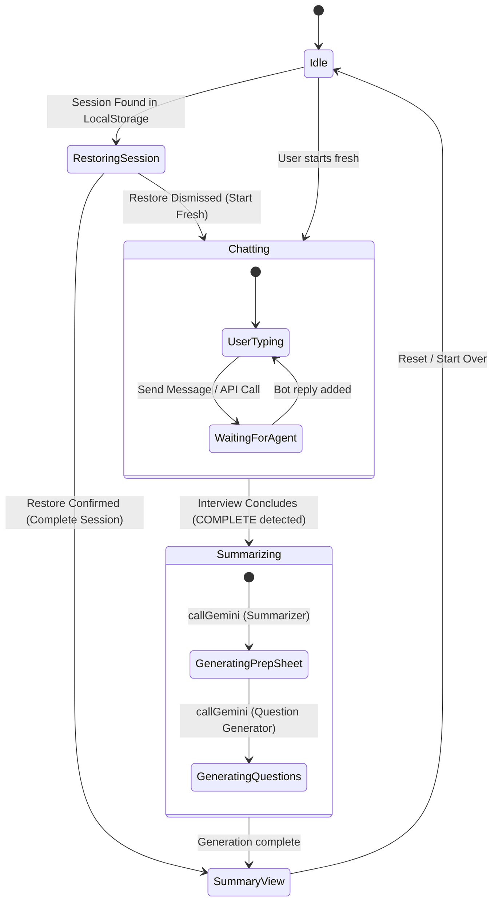

# VisitReady AI 🩺 — Project Architecture & Workflows

VisitReady AI is a clinical-preparatory web application designed to optimize communication between patients and doctors. By guiding patients through a structured, empathetic chat-based intake interview, the system gathers essential health concerns, compiles them into a clinical summary sheet, and suggests tailored questions to ask the physician.

This document outlines the detailed software architecture, multi-agent pipelines, and application state transitions.

---

## 🗺️ Multi-Agent Orchestration Pipeline

VisitReady organizes data flow sequentially across three distinct agents, each with a narrow role. This separation ensures factual reliability and adheres to safety boundaries (no diagnostics, no treatment suggestions).

```mermaid
graph TD
    %% Define Nodes
    Patient[Patient User] -->|1. Chat Inputs| Interviewer("Agent 1: Interviewer (Gemini)")
    Interviewer -->|2. Next Single Question| Patient
    
    %% Completeness Check
    Interviewer -->|3. Append [[COMPLETE]] when done| CompleteGate{"Complete?"}
    CompleteGate -->|No| Patient
    
    %% Summary Pipeline
    CompleteGate -->|Yes| Summarizer("Agent 2: Summarizer (Gemini)")
    Summarizer -->|4. Structure Transcript| PrepSheet["Visit Prep Sheet Structure"]
    
    %% Question Generation Pipeline
    PrepSheet -->|5. Read Factual Summary| QGenerator("Agent 3: Question Generator (Gemini)")
    QGenerator -->|6. Draft 3-4 Tailored Questions| Questions["Questions list"]
    
    %% Render UI
    PrepSheet -->|Render| UI["Interactive Prep Sheet UI"]
    Questions -->|Render| UI
```

---

## 📋 Sequential Intake Chat Flow

The Interviewer agent is strictly instructed to ask exactly one question at a time, gathering the patient's clinical history in a predefined order. If details are provided out of order, the agent acknowledges them and moves to the next missing detail.

```mermaid
sequenceDiagram
    autonumber
    actor Patient as Patient User
    participant AI as Agent 1: Interviewer
    
    AI->>Patient: Hello! What is the main symptom or concern you'd like to discuss?
    Patient->>AI: I have bad headaches.
    
    AI->>Patient: I'm sorry to hear that. When did these headaches start?
    Patient->>AI: Yesterday morning.
    
    AI->>Patient: Got it. How severe is the pain (mild, moderate, severe), and is it constant or coming and goes?
    Patient->>AI: Moderate and constant.
    
    AI->>Patient: Thank you. What makes the headaches feel better or worse?
    Patient->>AI: Resting in a dark room helps; screen light makes it worse.
    
    AI->>Patient: Noted. Are you currently taking medications, and do you have allergies?
    Patient->>AI: Aspirin helps sometimes, no allergies.
    
    AI->>Patient: Lastly, do you have any relevant medical history?
    Patient->>AI: I have high blood pressure.
    
    Note over AI: All 6 details gathered.<br/>Appends completed flag.
    AI->>Patient: Interview finished! Preparing your Prep Sheet... [[COMPLETE]]
```

---

## 🔄 Application State Machine

The React frontend maintains session states, handling local storage recoveries, loading animations during Gemini API calls, and displaying appropriate views based on the phase of the interview.



---

## 🛠️ Tech Stack & Implementation Details

- **Single Page Application**: Built with **React** and **Vite** for rapid hot-reloading and modular rendering.
- **Styling System**: Clean CSS with **HSL/CSS Variables** supporting automatic Dark Mode themes and high-contrast `@media print` queries.
- **Model Fallback Chain**: Queries the Gemini API using a fallback list of models (`gemini-2.5-flash-lite`, `gemini-3.1-flash-lite`, `gemini-2.5-flash`, `gemini-3.5-flash`) to ensure robust uptime.
- **Data Model (LocalStorage)**:
  ```json
  {
    "messages": [
      { "sender": "bot", "text": "..." },
      { "sender": "user", "text": "..." }
    ],
    "interviewComplete": true,
    "prepSheet": "### Summary of Concern...",
    "doctorQuestions": "- Question 1..."
  }
  ```
